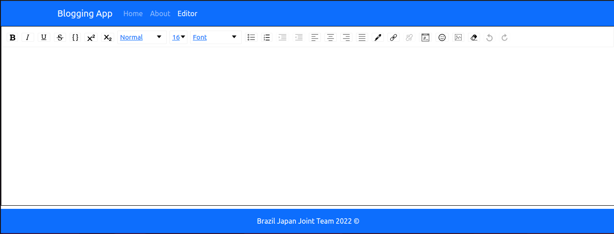
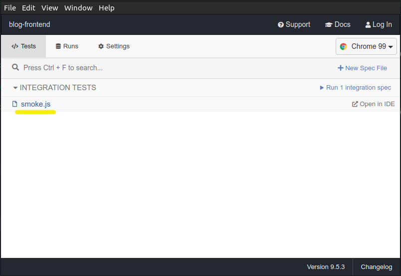
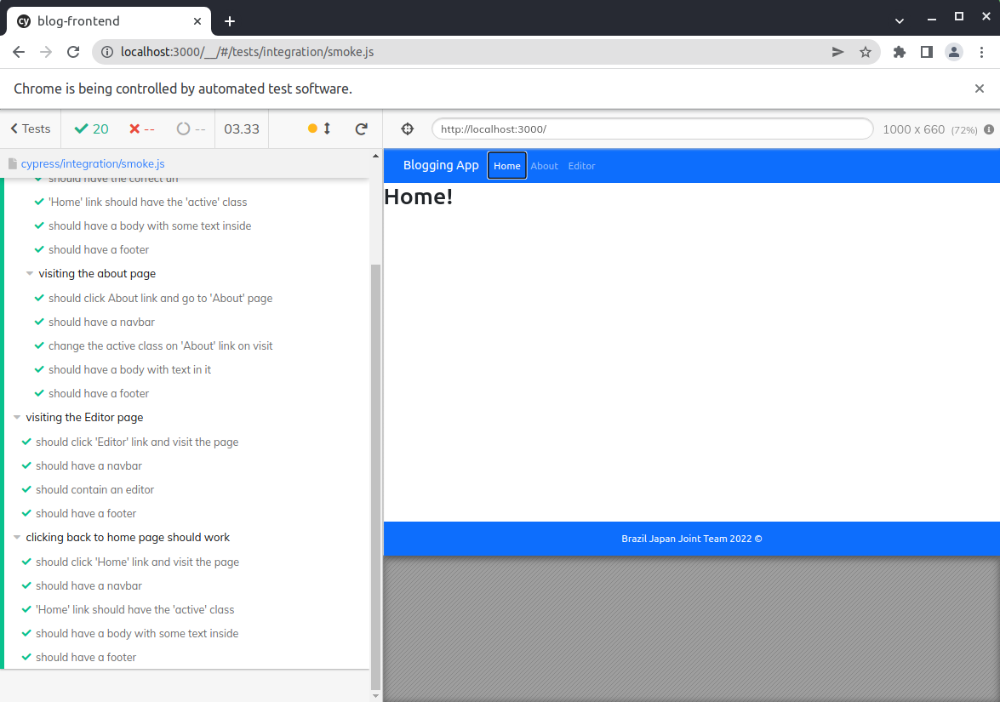

# Brazil Japan Joint Team Blogging App

A simple front-end for a full stack blogging application that uses [React](https://reactjs.org/) as the 
UI library. Very work in progress and we're not sure what the back-end will be yet. A future version 
of this application will have user login, authentication and possibly a news-feed of bloggers that you are 
subscribed to.

 

---

## Setup for Local Development

To clone the repository, run `git clone https://github.com/metallifax/bjjt-blog-frontend` in your
terminal

then change into the repository directory with `cd bjjt-blog-frontend`

Finally, if you use Node Package Manager, type `npm i` or `npm install` in your terminal, 
or if you use Yarn, just type `yarn` and run.

## Running the project

To start a development server that opens up in your default browser, type `npm start` or `yarn start`. 
If for some reason the development server doesn't automatically open, just visit `http://localhost:3000` 
in your browser to view the application.

## Running All Tests

This command will run all tests using all testing methods currently available in the project, 
which includes [ESLint](https://eslint.org/), [Prettier](https://prettier.io/), 
[React Testing Library](https://testing-library.com/docs/react-testing-library/intro/), 
and [Cypress](https://www.cypress.io/), all of which run in the console and will start up and shut down 
the server upon finishing the tests by leveraging 
[start-server-and-test](https://github.com/bahmutov/start-server-and-test). To run, simply type this in 
your terminal 

`npm run test-all` or `yarn test-all`

## End-to-End Testing /w Cypress

### Via the Cypress Open Command

To do end-to-end testing using Cypress and the built-in GUI, type:

`npm run cy:so` or `yarn cy:so`

Then when the Cypress Test GUI opens, click on the test you would like to run

 

A new window displaying the application will pop up and automatically run the selected E2E suite.

---

### Via the Cypress Run Command

Cypress offers the ability to do headless testing without the use of GUI. 
This will also need a running server in order for the test to run, but the results 
are the same and useful for remote testing. Just type 

`npm run cy:sr` or `yarn cy:sr` and the testing will take place in console.

## Run Unit Tests with React Testing Library

React projects are created with React Testing Library already installed in the project. Simply type

`npm test -- --watchAll=false` or `yarn test -- --watchAll=false` 

to run a Jest a single time or

`npm test` or `yarn test` to run Jest in watch mode, then press 'a' to run all tests or press 'q' to
quit.

## Run Formatting Check via Prettier

This project uses Prettier to enforce formatting rules. To do a check of both directories of interest, 
namely the `src/` and `cypress/`, run this command in terminal

`npm run format` or `yarn format`

## Run Linting Check via ESLint

This project uses ESLint as the linting tool to enforce styling rules, such as arrow functions over classic 
functions. To do a check of directories of interest, run this command in terminal

`npm run lint` or `yarn lint`

 

---

## Contributing

If you found this project in the ether somehow and would like to work on it, we're not open to outside help just yet, 
but I can see this project being a great way for new React developers to help out and make some beautiful UI. 
Feel free to open an issue before making a pull-request, and we can talk about where we think we're going to go with 
this application. Thank you for your interest.

 
